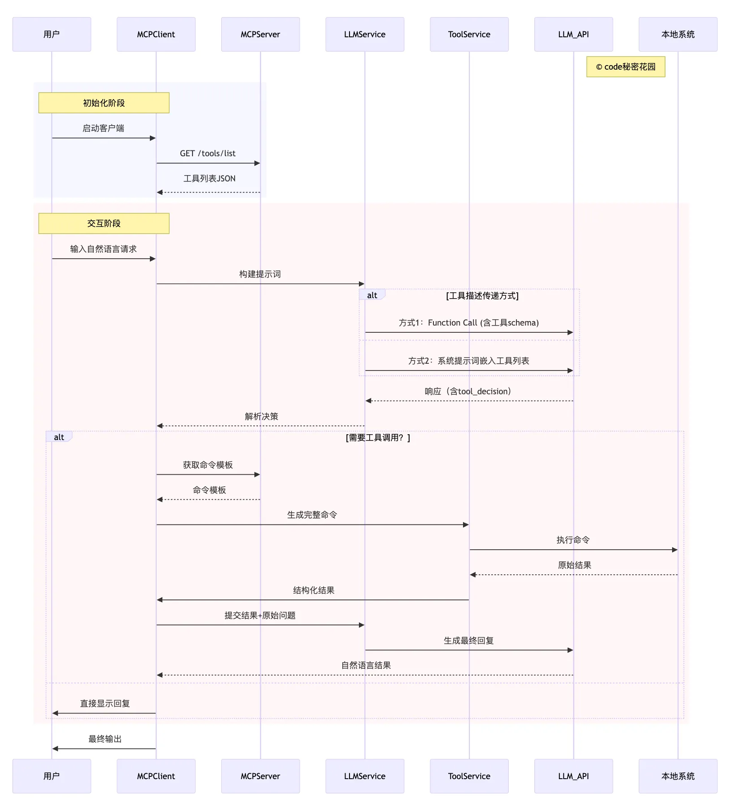

## 1.简介

MCP Client 是一个基于 Model Context Protocol 的 Node.js 客户端实现（使用 Function Calling），它允许您的应用连接到各种 MCP 服务器，并通过大语言模型（LLM）与这些服务器交互。MCP（模型上下文协议）是一个开放协议，用于标准化应用程序向 LLM 提供上下文的方式。

## 2.系统 & 目录

### 2.1 系统要求
- 建议Python版本为 `3.12` 以上
- LLM API 密钥

### 2.2 目录结构

```bash
├───.venv                 # uv 虚拟环境, （uv建立）
├───config                # MCP Server 配置文件
├───docs                  # 文档
├───mcp_client            # MCP 客户端
├───services              # MCP 服务器
├───.env.example           # 示例环境变量文件
├───mcp_client_main       # MCP 客户端主程序，依赖于 mcp_client 代码， 支持多MCP服务器
├───sample_mcp_client.py  # Sample MCP Client，只能支持单个 MCP 服务器
├───.python-version       # uv Python版本
├───pyproject.toml        # uv 环境依赖
└───uv.lock               # uv 锁文件
```

## 3.安装和配置

- 克隆仓库

```Bash
https://github.com/wdndev/tiny-mcp.git
cd tiny-mcp
```
- 安装UV

```Bash
# Linux & MAC
使用 curl 下载脚本并通过 sh 执行：

curl -LsSf https://astral.sh/uv/install.sh | sh

# Windows
使用 irm 下载脚本并通过 iex 执行：

powershell -ExecutionPolicy ByPass -c "irm https://astral.sh/uv/install.ps1 | iex"

```
- 安装依赖

```Bash
uv venv --python 3.12
uv sync
```
- 配置环境变量

```Bash
# 复制示例环境变量文件并设置你的 LLM API 密钥：

cp .env.example .env

# 然后编辑 .env 文件，填入你的 LLM API 密钥、模型提供商 API 地址、以及模型名称：

LLM_MODEL_TYPE = "deepseek"
LLM_API_URL = "https://api.deepseek.com"
LLM_API_KEY = "sk-xxxxxxxxxxxxxxxxxx"
LLM_MODEL_NAME = "deepseek-chat"


```

## 4.使用方法

激活uv环境

```Bash
# Linux & MAC
source .venv/bin/activate

# Windows
./.venv/Scripts/activate


```

要启动 MCP 客户端，可以使用以下几种方式：

#### （1）直接指定服务器脚本路径

```Bash
python sample_mcp_client.py <服务器脚本路径>
```

其中`<服务器脚本路径>`是指向 MCP 服务器脚本的路径，可以是 JavaScript (.js) 或 Python (.py) 文件。

#### （2）使用配置文件

```Bash
python sample_mcp_client.py <服务器标识符> <配置文件路径>
```

其中`<服务器标识符>`是配置文件中定义的服务器名称，`<配置文件路径>`是包含服务器定义的 JSON 文件的路径。

```JSON
{
    "mcpServers": {
      "get_current_time": {
        "name": "时间",
        "type": "stdio",
        "description": "获取时间",
        "command": "uv",
        "args": [
          "--directory",
          "E:/04Code/llm/tiny-mcp-demo/services",
          "run",
          "time_service.py"
        ]
      },
      "get_weather": {
        "name": "天气",
        "type": "stdio",
        "description": "获取国内天气",
        "command": "uv",
        "args": [
          "--directory",
          "E:/04Code/llm/tiny-mcp-demo/services",
          "run",
          "weather_service_zh.py"
        ]
      }
    },
    "defaultServer": "get_current_time",
    "system": "自定义系统提示词"
}
```

## 5.运行

直接指定服务器脚本路径运行

```Bash
(tiny-mcp) PS tiny-mcp> python sample_mcp_client.py services/weather_service_zh.py
[SYS]: 成功连接服务器，可用工具: ['get_weather']
[SYS]: MCP客户端已启动！
[SYS]: 输入自然语言查询开始交互（输入 'quit' 退出）
[USR]: 北京天气如何？适合去天安门吗？
[LOG]: 调用工具 [get_weather] 参数: {'location': '北京'}

[LLM]: 北京的天气是多云，温度为29°C，体感温度26°C，北风3级，湿度较低（18%），能见度良好（21公里）。

这样的天气适合去天安门游玩，但建议注意防晒和补水，因为湿度较低可能会感觉干燥。 

[USR]: 现在沈阳的天气怎么样呢？能出去踢足球吗？
[LOG]: 调用工具 [get_weather] 参数: {'location': '沈阳'}

[LLM]: 沈阳目前有小雨，气温为15°C，体感温度14°C，西南风2级，风速8公里/小时，相对湿度74%。由于有小雨，场地可能会比较湿滑，不太适合踢足球。建议等天气转晴后再安排户外活动。 

[USR]: quit
```

使用配置文件

```Bash
(tiny-mcp) PS tiny-mcp> python sample_mcp_client.py get_weather config/server_config.json
[SYS]: 成功连接服务器，可用工具: ['get_weather']
[SYS]: MCP客户端已启动！
[SYS]: 输入自然语言查询开始交互（输入 'quit' 退出）
[USR]: 珠海天气怎么样？适合出行吗？
[LOG]: 调用工具 [get_weather] 参数: {'location': '珠海'}

[LLM]: 珠海目前的天气情况如下：

- **天气**：阴天
- **温度**：25°C（体感温度27°C）
- **风向**：南风，风力3级，风速14公里/小时
- **湿度**：92%
- **能见度**：12公里
- **降水量**：过去1小时无降水

总体来说，天气较为阴湿，但温度适中，风力不大，适合出行。建议根据个人对湿度的适应情况决定是否外出，并可以携带雨具以防万一。 

[USR]: 北京的天气如何？能去参观天安门吗？
[LOG]: 调用工具 [get_weather] 参数: {'location': '北京'}

[LLM]: 北京的天气目前是中雨，温度为11°C，体感温度为10°C，北风2级，相对湿度100%，能见度为4公里。由于下雨，可能会影响户外活动。

如果您计划参观天安门，建议携带雨具，并注意地面湿滑。如果雨势较大，可能会影响游览体验，建议根据天气情况灵活调整行程。
```

## 6.工作原理



1. 服务器连接：客户端连接到指定的 MCP 服务器
2. 工具发现：自动获取服务器提供的可用工具列表
3. 查询处理：
   - 将用户查询发送给 LLM
   - LLM 决定是否需要使用工具
   - 如果需要，客户端通过服务器执行工具调用
   - 将工具结果返回给 LLM
   - LLM 提供最终回复
4. 交互式循环：用户可以不断输入查询，直到输入"quit"退出

## 7.参考文档

- [MCP Docs](https://modelcontextprotocol.io)
- [MCP Docs cn](https://mcp-docs.cn)
- [UV Docs](https://hellowac.github.io/uv-zh-cn)

