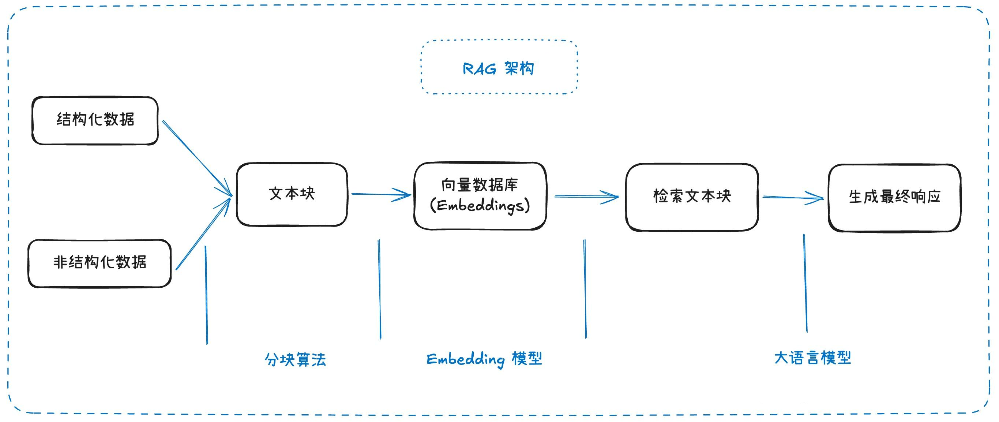
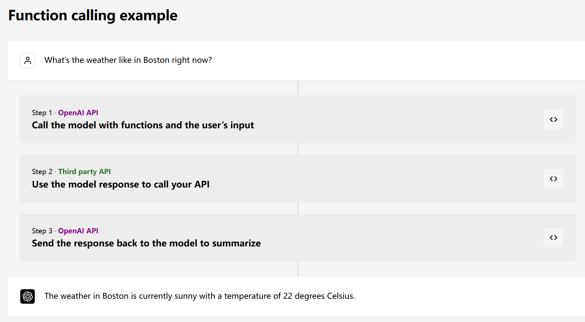
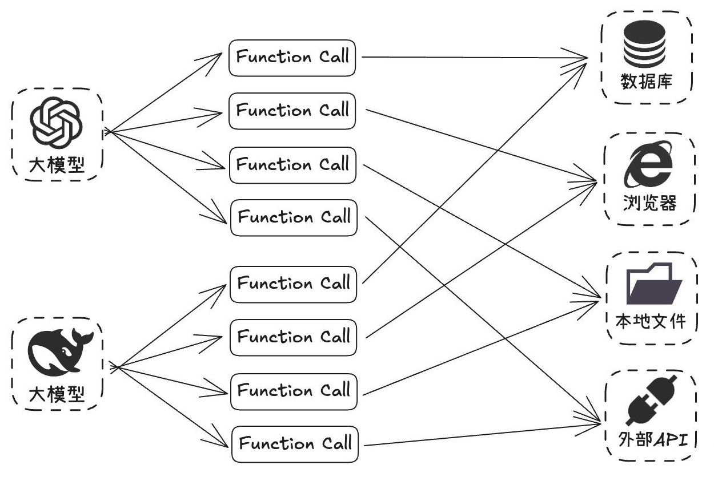
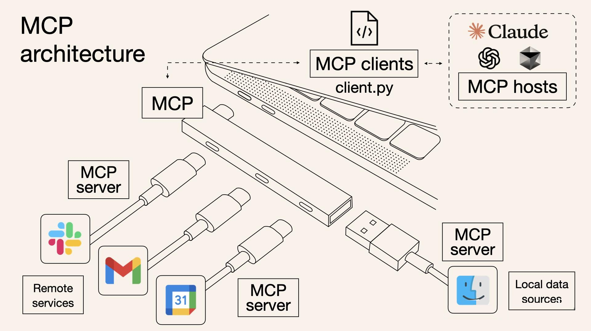
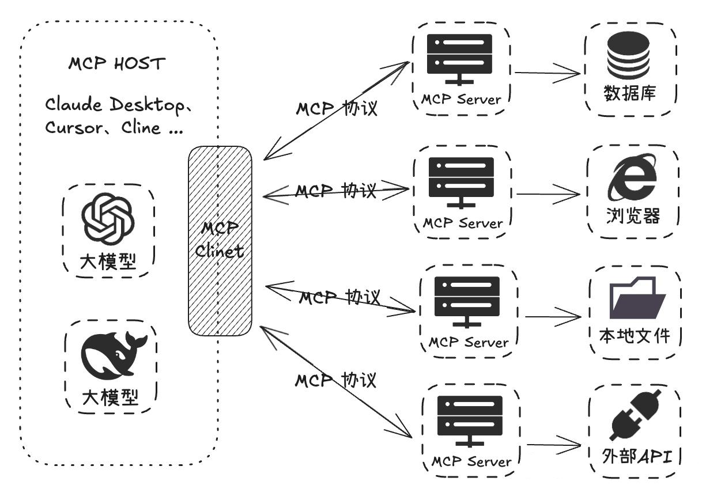

# 1.MCP基础知识

## 1.RAG局限性

RAG，即检索增强生成（Retrieval-Augmented Generation），是目前大模型领域的一个热门方向。它将信息检索技术与生成式模型相结合，解决大模型在知识准确性、上下文理解以及对最新信息的利用等方面的难题。



**RAG技术流程**：RAG 最核心的就是先将知识转换成 “向量“ ，导入 “向量数据库“，然后在将用户输入的信息也转换成 “向量” ，然后再去向量数据库匹配出相似的 “向量“，最后再由大模型去总结检索到的内容。

从`RAG`本身技术原理的角度出发，目前存在着以下问题：

- **检索精度不足**：RAG中，大模型仅仅起到了总结的作用，而检索到信息的精准度大部分情况下取决于检索算法（召回→ 排序），检索结果可能包含无关内容（低精确率）或遗漏关键信息（低召回率）。
- **生成内容不完整**：由于 RAG 处理的是文档的切片，而切片的局部性注定了它无法看到整篇文档的信息。
- **缺乏大局观**：RAG 无法判断需要多少个切片才能回答问题，也无法判断文档间的联系。
- **多轮检索能力弱**：RAG 缺乏执行多轮、多查询检索的能力，而这对推理任务来说是必不可少的。

尽管近期也有些新出现的技术，如`GraphRAG、KAG`等能够在一定程度上解决这些问题，但都还不成熟，目前的 RAG 技术还远远达不到我们预期想要的效果。

## 2.Function Call

以前的 AI 大模型就像一个知识丰富但被困在屋子里的人，只能依靠自己已有的知识回答问题，无法直接获取实时数据或与外部系统交互，比如不能直接访问数据库里的最新信息，也不能使用一些外部工具来完成特定任务。

`Function Call`是`OPEN AI`在`2023`年推出的一个非常重要的概念：



`Function Call`（函数调用） 本质上就是**提供了大模型与外部系统交互的能力，类似于给大模型安装一个 “外挂工具箱”**。当大模型遇到自己无法直接回答的问题时，它会主动调用预设的函数（如查询天气、计算数据、访问数据库等），获取实时或精准信息后再生成回答。

这个能力确实是挺好的，给了大模型更多的可能性，但是它有一个比较大的缺点，就是实现成本太高了。

在`MCP`出现之前，开发者想实现`Function Call`的成本是比较高的，首先得需要模型本身能够稳定支持`Function Call`的调用，比如在 Coze 中选择某些模型时提示，选择的模型不支持插件的调用，其实就是不支持`Function Call`的调用。

在模型训练微调时，标准的sharegpt风格的数据集中提供了专门用于Function Call训练的特殊字段：

```json 
[
  {
    "conversations": [
      {
        "from": "human",
        "value": "人类指令"
      },
      {
        "from": "function_call",
        "value": "工具参数"
      },
      {
        "from": "observation",
        "value": "工具结果"
      },
      {
        "from": "gpt",
        "value": "模型回答"
      }
    ],
    "system": "系统提示词（选填）",
    "tools": "工具描述（选填）"
  }
]
```


这也就意味着模型本身需要进行过专门的`Function Call`调用微调才能稳定支持这种能力。

另外还有一个比较大的问题，`OPEN AI`最开始提出这项技术的时候，并没有想让它成为一项标准，所以虽然后续很多模型也支持了`Function Call`的调用，但是各自实现的方式都不太一样。

这也就意味着，如果要发开一个`Function Call`工具，需要对不同的模型进行适配，比如参数格式、触发逻辑、返回结构等等，这个成本是非常高的。



## 3.Model Context Protocol

### 3.1 MCP

MCP（`Model Context Protocol`，模型上下文协议）是一种由`Anthropic`公司（也就是开发 Claude 模型的公司）推出的一个开放标准协议，目的就是为了解决 AI 模型与外部数据源、工具交互的难题。



通过`Function Call`，每次要让模型连接新的数据源或使用新工具，开发者都得专门编写大量代码来进行对接，既麻烦又容易出错。而`MCP`的出现就是为了解决这些问题，它就像是一个 “通用插头” 或者 “USB 接口”，制定了统一的规范，不管是连接数据库、第三方 API，还是本地文件等各种外部资源，都可以通过这个 “通用接口” 来完成，让 AI 模型与外部工具或数据源之间的交互更加标准化、可复用。

MCP Host，比如 Claude Desktop、Cursor 这些工具，在内部实现了 MCP Client，然后 MCP Client 通过标准的 MCP 协议和 MCP Server 进行交互，由各种三方开发者提供的 MCP Server 负责实现各种和三方资源交互的逻辑，比如访问数据库、浏览器、本地文件，最终再通过 标准的 MCP 协议返回给 MCP Client，最终在 MCP Host 上展示。



开发者按照 MCP 协议进行开发，无需为每个模型与不同资源的对接重复编写适配代码，可以大大节省开发工作量，另外已经开发出的 MCP Server，因为协议是通用的，能够直接开放出来给大家使用，这也大幅减少了开发者的重复劳动。

比如，你如果想开发一个同样逻辑的插件，你不需要在 Coze 写一遍，再去 Dify 写一遍，如果它们都支持了 MCP，那就可以直接使用同一个插件逻辑。

### 3.3 MCP vs Function Call

|        | Function Calling  | MCP                 |
| ------ | ----------------- | ------------------- |
| 协议标准   | 私有协议（各模型自订规则）     | 开放协议（JSON-RPC 2.0）  |
| 工具发现   | 动态请求              | 静态预定义               |
| 调用方式   | 同进程函数或API         | Stdio/SSE同进程        |
| 扩展成本   | 高（新增工具需要调整模型）     | 低（工具热插拔，模型无需改动）     |
| 适用场景   | 简单任务（单次函数调用）      | 复杂流程（多工具协同+数据交互）    |
| 工程复杂度  | 低（快速接入单个工具）       | 高（需部署MCP服务器+客户端）    |
| 生态协作   | 工具与模型强绑定          | 工具开发者与Agent开发者解耦    |


