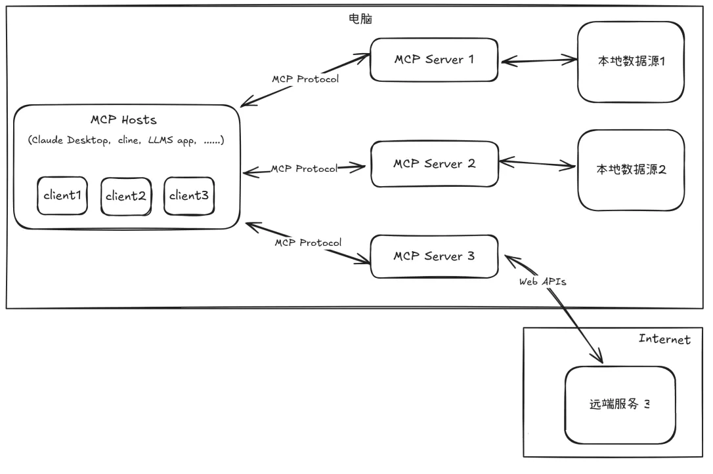
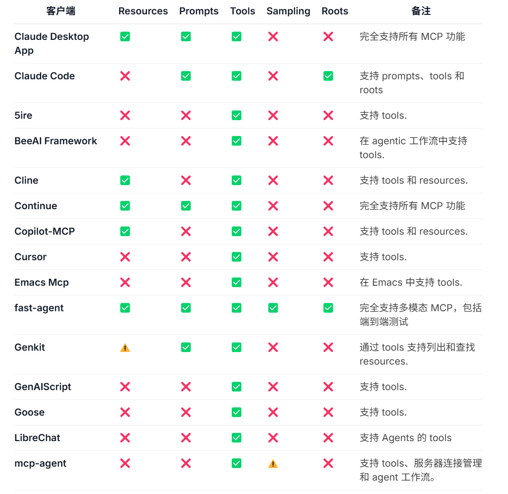
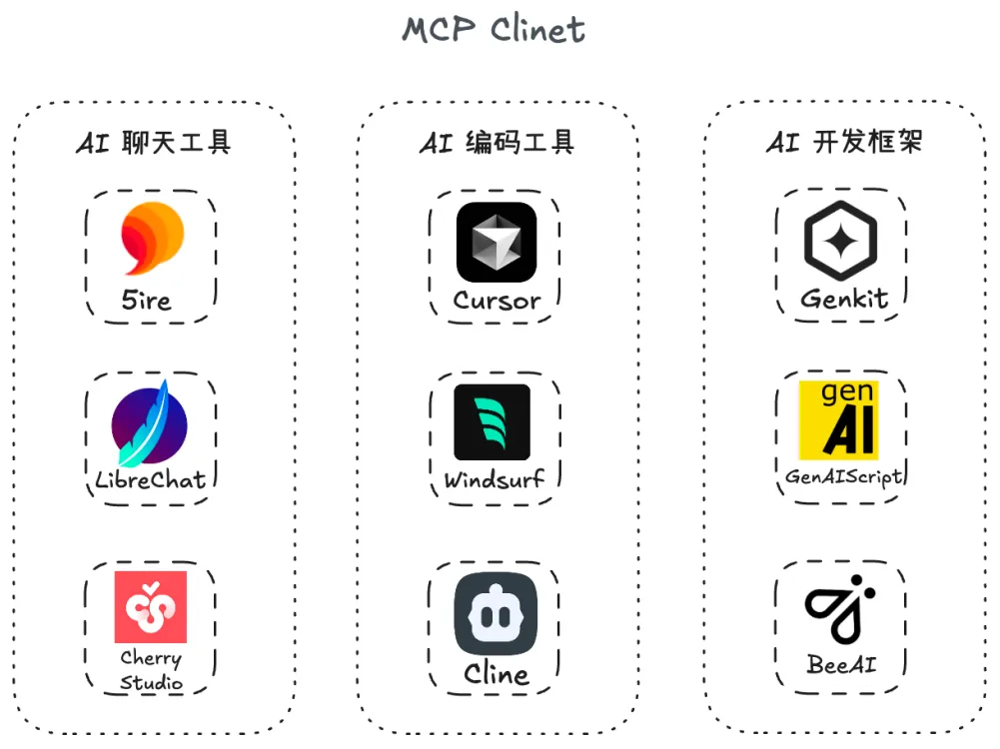
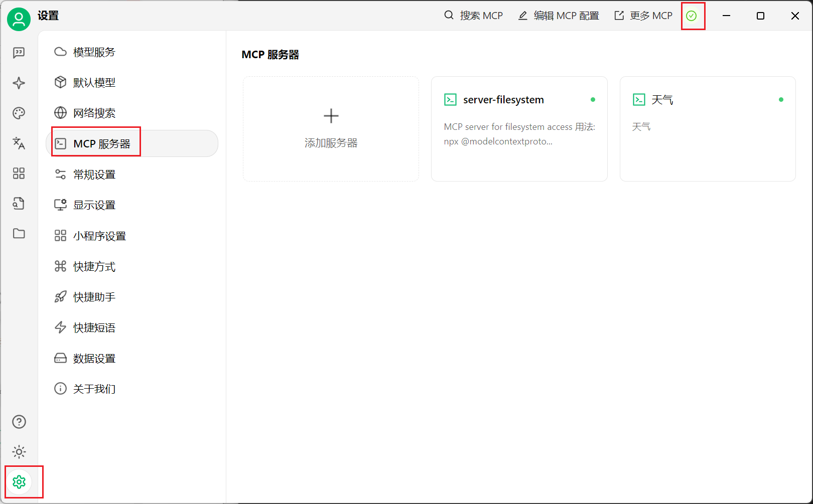
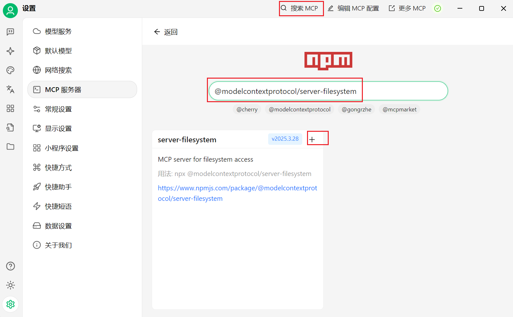
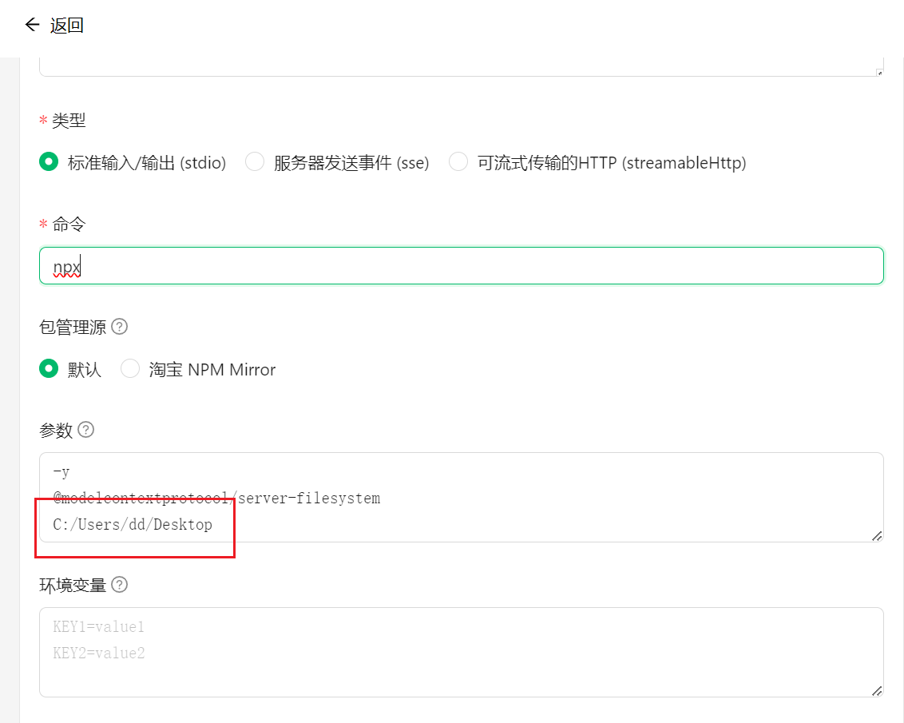
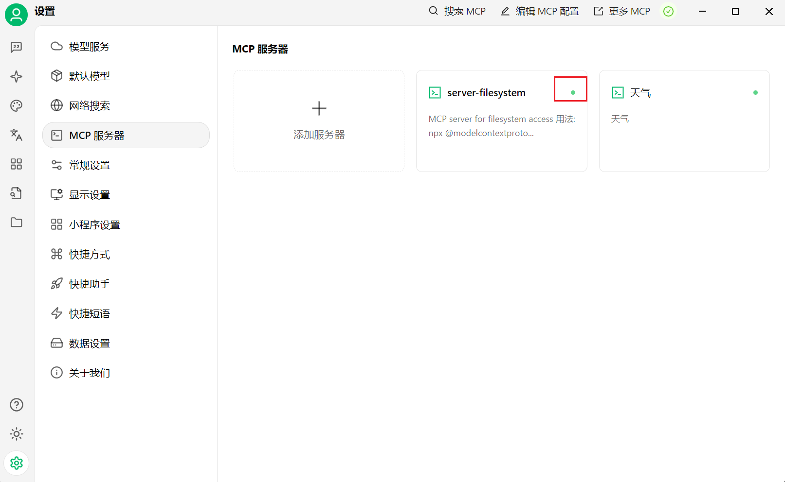
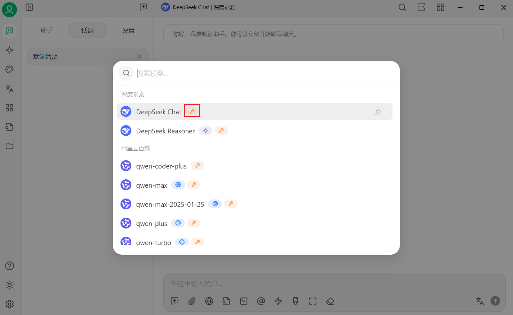
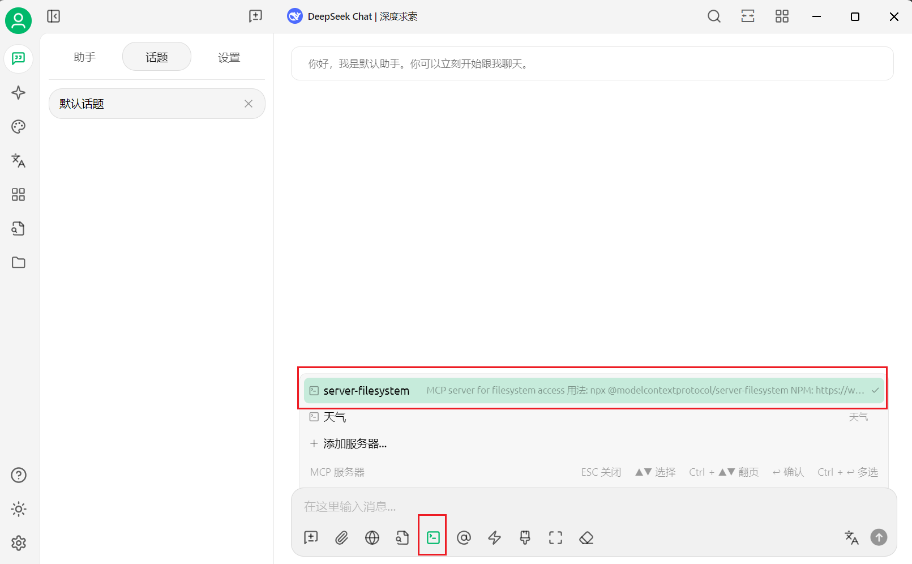
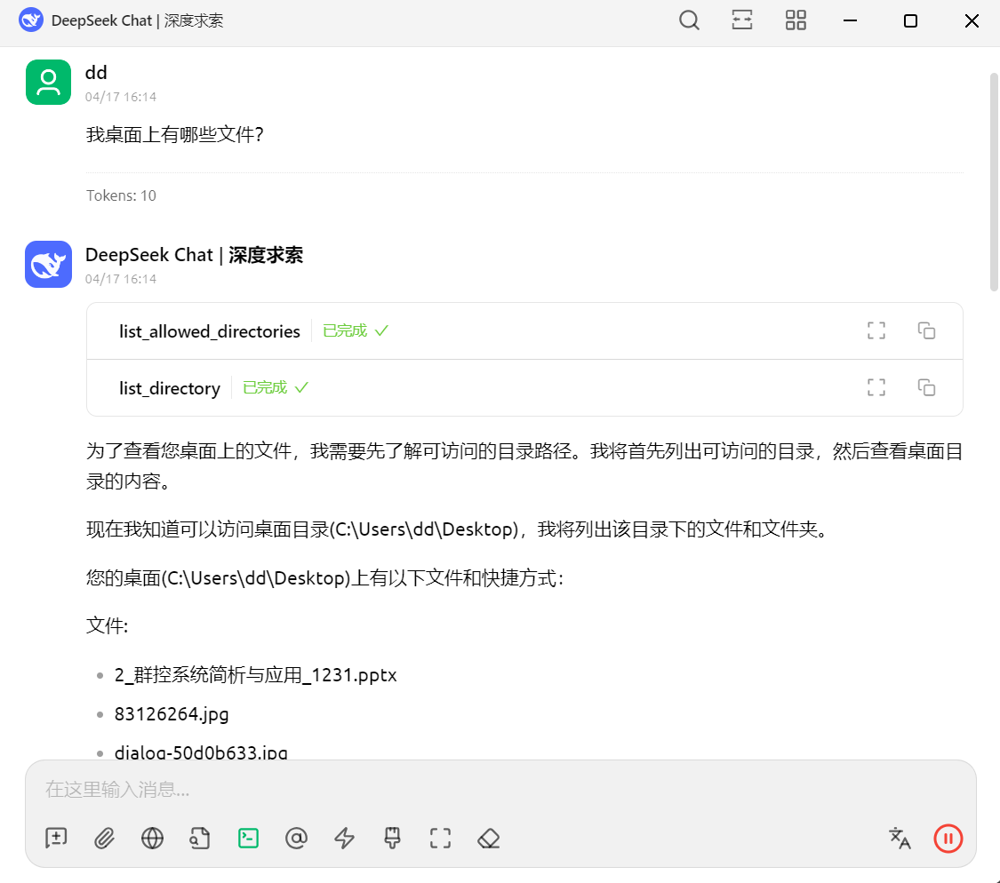

# 2.MCP基本使用（Cherry Studio）

## 1.MCP架构

在整个MCP的应用场景中，整体架构如下：

- **MCP Hosts**: 希望通过 MCP 访问数据的程序，如 Claude Desktop、Cline等开发工具或AI应用
- **MCP Clients**: 与服务器保持 1:1 连接的协议客户端
- **MCP Servers**: 轻量级程序，每个程序通过标准化的Model Context Protocol (MCP)暴露特定的能力
- **本地数据源（Local Data Sources）**: 您计算机中，MCP 服务器可以安全访问的文件、数据库和服务
- **远程服务（Remote Services）**: 可以通过互联网（例如，通过 API）访问的外部系统，MCP 服务器可以连接到这些系统

## 2.MCP客户端（Host）

在 MCP 官方文档中，看到已经支持了 MCP 协议的一些客户端/工具列表：

从表格里，可以看到，MCP 对支持的客户端划分了五大能力，这里先简单了解即可：

- **Tools**：服务器暴露可执行功能，供 LLM 调用以与外部系统交互。
- **Resources**：服务器暴露数据和内容，供客户端读取并作为 LLM 上下文。
- **Prompts**：服务器定义可复用的提示模板，引导 LLM 交互。
- **Sampling**：让服务器借助客户端向 LLM 发起完成请求，实现复杂的智能行为。
- **Roots**：客户端给服务器指定的一些地址，用来告诉服务器该关注哪些资源和去哪里找这些资源。

目前最常用，并且被支持最广泛的就是`Tools`工具调用。

对于上面这些已经支持 MCP 的工具，其实整体划分一下就是这么几类：

- AI 聊天工具：如 5ire、LibreChat、Cherry Studio
- AI 编码工具：如 Cursor、Windsurf、Cline
- AI 开发框架：如 Genkit、GenAIScript、BeeAI

## 3.MCP Server

`MCP Server`的官方描述：一个轻量级程序，每个程序都通过标准化模型上下文协议公开特定功能。

简单理解，就是通过标准化协议与客户端交互，能够让模型调用特定的数据源或工具功能。常见的`MCP Server`有：

- **文件和数据访问类**：让大模型能够操作、访问本地文件或数据库，如 File System MCP Server；
- **Web 自动化类**：让大模型能够操作浏览器，如 Pupteer MCP Server；
- **三方工具集成类**：让大模型能够调用三方平台暴露的 API，如 高德地图 MCP Server；

下面是一些可以查找到你需要的`MCP Server`的途径：

- [MCP Server Github](https://github.com/modelcontextprotocol/servers "MCP Server Github")：官方的`MCP Server`集合 Github 仓库，里面包含了作为官方参考示例的`MCP Server`、被官方集成的`MCP Server`以及一些社区开发的第三方`MCP Server`。
- [MCP.so](http://MCP.so "MCP.so")：一个三方的 MCP Server 聚合平台，目前收录了 5000+ MCP Server。
- [MCP Market](https://mcpmarket.cn "MCP Market")：访问速度不错，可以按工具类型筛选。

## 4.在 Cherry Studio 中尝试 MCP

打开`Cherry Studio`客户端，到「设置 - MCP 服务器」把上面提示的两个环境完成安装：

然后，在搜索框搜索`@modelcontextprotocol/server-filesystem`，这里接入一个简单的文件系统 MCP：

点击 + ，它会帮我们默认创建好一些 MCP Server 的配置，这里要补充一个参数，允许让它访问的文件夹路径，比如`~/Desktop`：

然后我们点击保存，如果服务器的绿灯亮起，说明配置成功：

下面，到聊天区域选择一个模型， 注意这里一定要选择带扳手🔧图标的模型，只有这种工具才支持 MCP（因为 Cherry Studio 其实本质上还是基于 Function Call 实现的 MCP，所以只有部分模型支持）

然后我们发现下面工具箱多了 MCP 的开关，我们把它打开：

然后尝试让他访问我桌面上有哪些文件：

调用成功，这就是一个最简单的 MCP 调用示例了。

