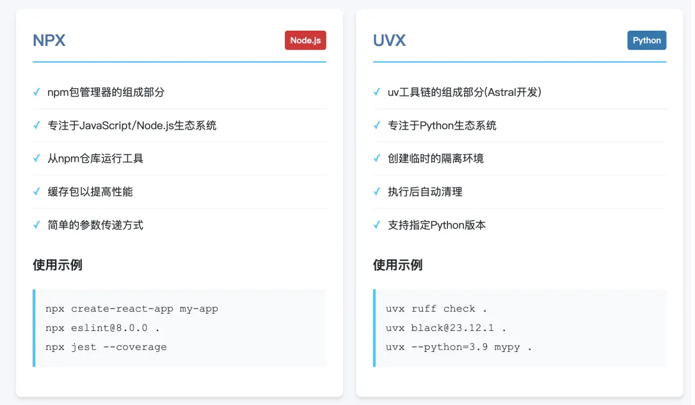

# 3.Cline & MCP配置

使用 Cherry Studio 中的 MCP 服务配置来举例。

## 1.通信协议

`MCP`协议中的`STDIO`和`SSE`其实就是是两种不同的（`MCP Server`与`MCP Client`）通信模式：

- **STDIO（标准输入输出）**：客户端和服务器通过本地进程的标准输入和标准输出直接通信。
- **SSE（服务器推送事件）**：客户端通过 HTTP 协议连接到远程服务器，服务器可以主动推送数据（如实时消息）。

简单理解，STDIO 调用方式是将一个`MCP Server`下载到本地，直接调用这个工具，而 SSE 则是通过 HTTP 服务调用托管在远程服务器上的`MCP Server`。

这就是一个 SSE MCP Server 的配置示例，非常简单，直接使用网络协议和工具进行通信：

```json 
{
  "mcpServers": {
    "browser-use-mcp-server": {
      "url": "http://localhost:8000/sse"
    }
  }
}
```


而之前用到的`FileSystem、Mongodb`都属于典型的`STDIO`调用：

```json 
{
  "mcpServers": {
    "mongodb": {
      "command": "npx",
      "args": [
        "-y",
        "@modelcontextprotocol/server-filesystem",
        "~/Downloads"
      ]
    }
  }
}
```


`STDIO`为程序的输入输出提供了一种统一的标准方式，无论是什么类型的程序，只要遵循`STDIO`协议，就可以方便地进行数据的输入和输出，并且可以很容易地与其他程序或系统组件进行交互。

## 2.命令和参数

对应 JSON 配置中的`command`参数，在没有填写时，这里默认推荐的是 `uvx `和 `npx`：

- `npx`是`Node.js`生态系统中的一个命令行工具，它本质上是`npm`的一个扩展。npx 的名字可以理解为“运行一个包”（`npm execute package`）的缩写。
- `uvx`，与`npx`类似，它也可以直接让你临时执行某个工具包，而无需全局安装。不过`uvx`：是`uv`工具链的一部分，主要聚焦于`Python`生态系统，它会创建一个临时的隔离`Python`环境来运行`Python`工具包。



`filesystem`配置示例：

```json 
{
  "mcpServers": {
    "mongodb": {
      "command": "npx",
      "args": [
        "-y",
        "@modelcontextprotocol/server-filesystem",
        "C:/Users/dd/Desktop"
      ]
    }
  }
}
```


- `args`里第一个参数`"-y"`其实就等同于 --yes，其作用是在执行命令时自动同意所有提示信息，可以避免交互式的确认步骤。
- 第二个参数就是这个`npm`包的名字，比如`@modelcontextprotocol/server-filesystem`这个包。
- `args`里的第三个参数其实就是传递给这个包的一个必备参数：允许读取的本机路径。

这几个信息，再加上大模型分析用户输入后得出的参数，通过`STDIO`协议传递给这个包，其实就可以构成一条在终端直接可以运行的一条命令：

```javascript 
npx -y @modelcontextprotocol/server-filesystem ~/Downloads  <<< '{"method":"tools/call","params":{"name":"list_directory","arguments":{"path":"C:/Users/dd/Desktop"}},"jsonrpc":"2.0","id":1}'
```


## 3.Windows下的配置

在实际使用中，大家可能会发现，下面的配置在 Windows 下可能不会生效

```json 
{
  "mcpServers": {
    "mongodb": {
      "command": "npx",
      "args": [
        "-y",
        "@modelcontextprotocol/server-filesystem",
        "~/Downloads"
      ]
    }
  }
}
```


需要改成下面的方式：

```json 
{
  "mcpServers": {
    "mongodb": {
      "command": "cmd",
      "args": [
        "/c",
        "npx",
        "-y",
        "@modelcontextprotocol/server-filesystem",
        "~/Downloads"
      ]
    }
  }
}
```


这是因为在不同操作系统下**默认命令解释器（Shell）的工作机制不同**：

`macOS`的终端（如`bash/zsh`）是`Unix shell`，支持直接执行可执行文件（如`npx`）。

Windows 的默认命令解释器是`cmd.exe`，而非直接执行程序。即使`npx`已安装（如通过全局`npm install -g npx`），也需要通过`cmd.exe`来调用，因为：

- Windows 不直接识别 Unix 风格的命令路径（如`npx`本质是 Node.js 脚本，需通过`node`执行）。
- `cmd.exe`需要明确的指令格式（如`/c`参数用于执行命令后退出）。

`args`中的`/c`是`cmd.exe`的参数，表示“执行后续命令后关闭窗口”。完整的执行流程是：

```bash 
cmd.exe /c npx -y @modelcontextprotocol/server-filesystem"~/Downloads"
```


> 这里`cmd.exe`先解析`/c`，再将`npx ...`作为子命令执行，确保 Windows 能正确调用 Node.js 脚本（`npx`）。

