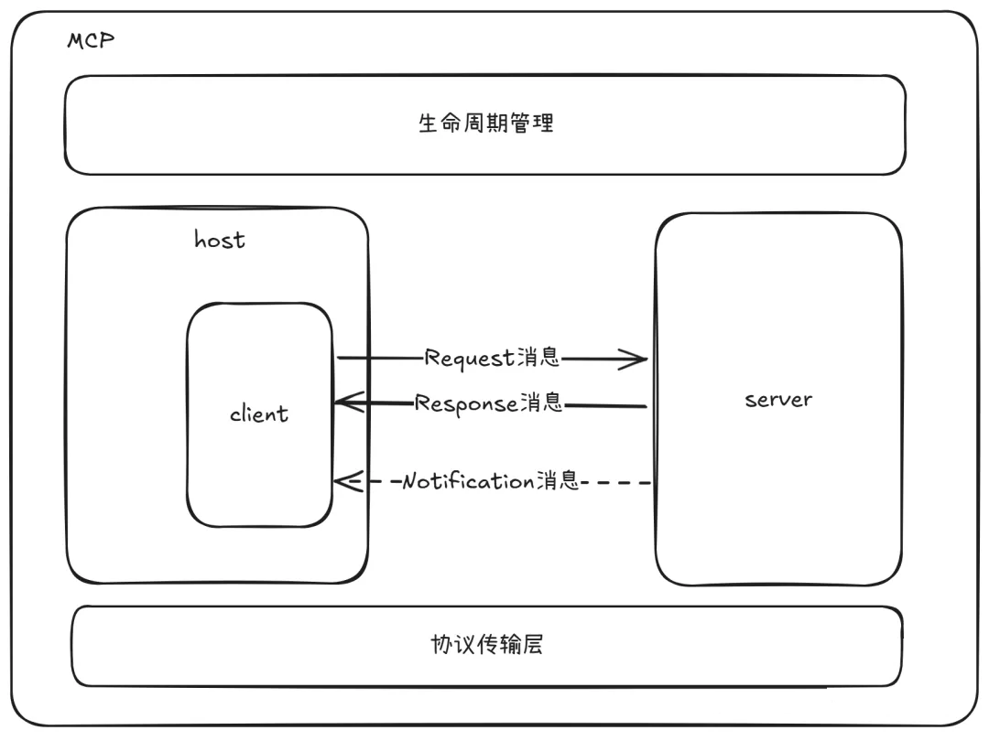
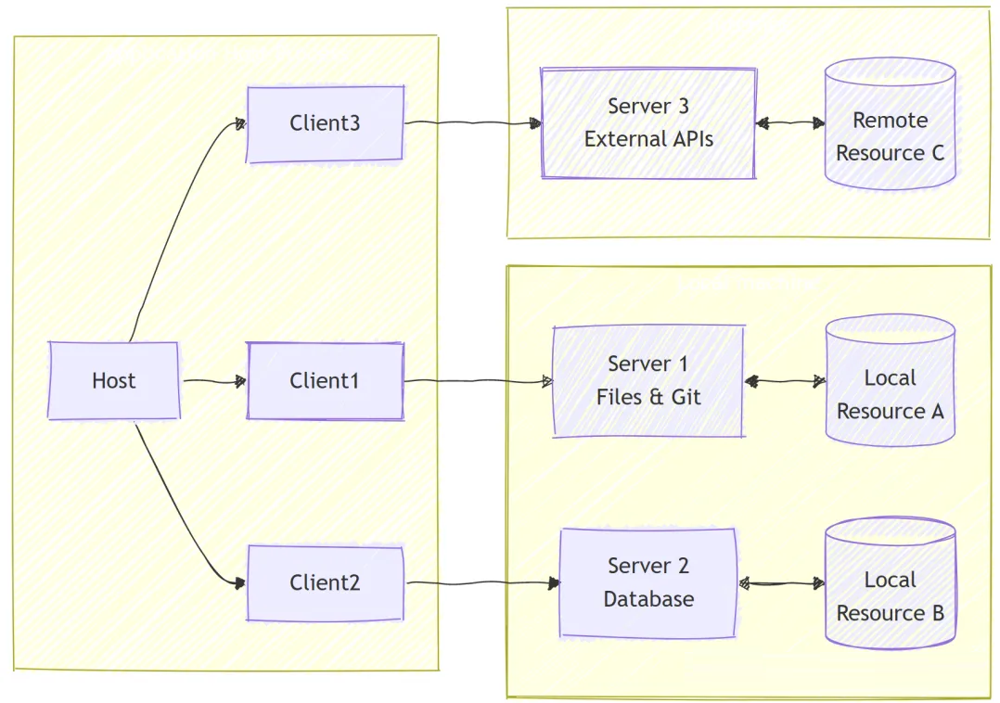
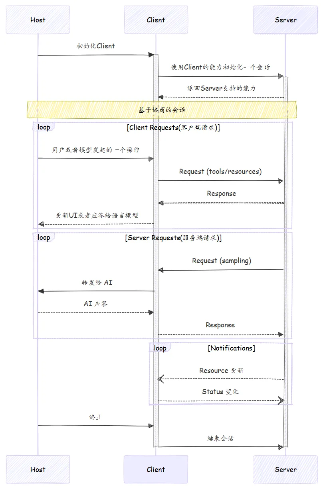
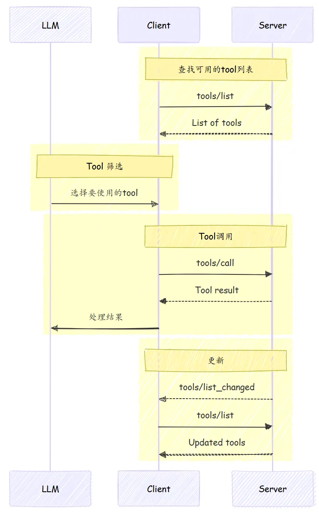
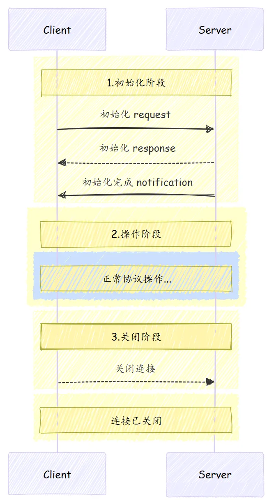

# 4.MCP规范协议

MCP 作为连接**AI 应用**与数据源的通用开放标准，通过单一协议取代了碎片化的集成方式，使小型**AI 应用**具备更强的能力。

MCP 的运行遵循一套完整的规范，用以定义MCP架构和整个交互流程。

Anthropic 在发布 MCP 时，公开了详细的**Model Context Protocol**规范以及支持多种语言的 SDK，详见：[https://github.com/modelcontextprotocol。](https://github.com/modelcontextprotocol。 "https://github.com/modelcontextprotocol。")

整个规范，可以分几个大块来了解：**协议架构、协议基本消息类型、协议生命周期管理、协议的传输层**



## 1.协议架构

Model Context Protocol (MCP) 采用 client-host-server 架构，每个 host 可以运行多个client实例。

这种架构使用户能够在各个应用程序中集成人工智能能力，同时保持清晰的安全边界并隔离关注点。

MCP 基于 JSON-RPC 构建，提供了一种有状态的会话协议，专注于上下文交换和 clients 与servers之间的采样协调。

> JSON-RPC 2.0 规范:[https://www.jsonrpc.org/specification](https://www.jsonrpc.org/specification "https://www.jsonrpc.org/specification")

### 1.1 基本组件



#### （1）Host

Host进程充当容器和协调者（比如Cline，cursor等）：

- 创建和管理多个客户端实例
- 控制客户端连接权限和生命周期
- 协调 AI/LLM 集成和采样
- 管理Clients之间的上下文聚合

#### （2）Clients

每个客户端由Host创建，并保持一个独立的 server 连接（比如由Cline代码内嵌的SDK Client）：

- 和每个 server 建立一个有状态的会话
- 处理协议协商和能力交换
- 双向路由协议消息
- 管理订阅和通知
- 维护 servers 之间的安全边界

host 应用程序创建并管理多个 clients，每个 client 与特定 server 之间具有一对一的关系。

#### （3）Servers

server 提供专业的上下文和能力：

- 通过 MCP 原语暴露resources、tools 和prompts
- 通过client 提供的接口请求sampling
- 可以是本地进程或远程服务

### 1.2 基本消息类型

MCP 定义了基于 JSON-RPC 2.0 的三种核心消息类型：

- **Requests**: 双向消息，带有方法和参数，期望有响应
- **Responses**: 匹配特定请求 ID 的成功结果或错误
- **Notifications**: 无需回复的单向消息

### 1.3 能力协商

Model Context Protocol 使用了一种**基于能力（capability-based）的协商机制**，在初始化阶段，clients和servers会明确声明它们支持的功能，而这些能力决定了在会话期间可以使用哪些协议特性和原语（primitives）



## 2.协议基本消息类型

所有在 MCP clients 和 servers 之间的消息必须遵循 JSON-RPC 2.0 规范。该协议定义了三种基本类型的消息：

| 消息类型               | 描述                                                 | 约束                |
| ------------------ | -------------------------------------------------- | ----------------- |
| \`Requests\`       | 用于具体操作的消息，比如查询所有Tool、调用Tool等，\*\*支持的所有类型详见2.1\*\*  | 必须包含唯一的 ID 和方法名称  |
| \`Responses\`      | 应答\`Requests\`                                     | 必须包含与请求相同的 ID     |
| \`Notifications\`  | 单向消息，不需要回复                                         | 不得包含 ID           |

### 2.1 Requests（消息请求）

`Requests`可以从Client端或者Server端发起

#### （1）格式要求

```json 
{
  jsonrpc: "2.0";
  id: string | number;
  method: string;
  params?: {
    [key: string]: unknown;
  };
}
```


- 请求必须包含一个字符串或整数类型的 ID。
- ID 不能为`null`。
- 请求 ID 在同一会话中不得被请求者之前使用过。

#### （2）Requests关键业务类型

| Request method            | 发起方     | 响应方     | 描述                                      |
| ------------------------- | ------- | ------- | --------------------------------------- |
| initialize                | Client  | Server  | 初始化会话                                   |
| tools/list                | Client  | Server  | 发现可用的工具                                 |
| tools/call                | Client  | Server  | 调用工具                                    |
| resources/list            | Client  | Server  | 发现可用的资源                                 |
| resources/read            | Client  | Server  | 要获取资源内容                                 |
| resources/templates/list  | Client  | Server  | 发现可用的参数化资源                              |
| resources/subscribe       | Client  | Server  | 以订阅特定资源，并在其发生变化时接收通知                    |
| prompts/list              | Client  | Server  | 发现可用的提示词                                |
| prompts/get               | Client  | Server  | 要获取特定的提示词                               |
| roots/list                | Server  | Client  | 列出Server有权限访问Client的文件系统Root节点，暴露目录和文件  |
| sampling/createMessage    | Server  | Client  | 使Server能够利用 AI 能力的生成能力                  |

### 2.2 Responses（消息应答）

`Responses`是对requests的回复。

#### （1）格式要求

```json 
{
  jsonrpc: "2.0";
  id: string | number;
  result?: {
    [key: string]: unknown;
  }
  error?: {
    code: number;
    message: string;
    data?: unknown;
  }
}
```


- Responses 必须包含与其对应 request 相同的 ID。
- 必须设置`result`或`error`之一。不得同时出现。
- 错误代码必须是整数。

### 2.3 Notifications（通知）

`Notifications`是从client 发送到server 或反向发送的。不需要回复。

#### （1）格式要求

```json 
{
  jsonrpc: "2.0";
  method: string;
  params?: {
    [key: string]: unknown;
  };
}
```


- 通知不得包含 ID。

### 2.4 示例：Client获取Server Tool列表



要查询可用的工具，Client发送一个`tools/list`请求

#### （1）Request（请求）

```json 
{
  "jsonrpc": "2.0",
  "id": 1,
  "method": "tools/list",
  "params": {
    "cursor": "optional-cursor-value"
  }
}
```


#### （2）Response（响应）

```json 
{
  "jsonrpc": "2.0",
  "id": 1,
  "result": {
    "tools": [
      {
        "name": "get_weather",
        "description": "Get current weather information for a location",
        "inputSchema": {
          "type": "object",
          "properties": {
            "location": {
              "type": "string",
              "description": "City name or zip code"
            }
          },
          "required": ["location"]
        }
      }
    ],
    "nextCursor": "next-page-cursor"
  }
}
```


## 3.协议生命周期管理



1. **Initialization（初始化）**: 能力协商和协议版本一致
2. **Operation（操作）**: 正常的协议通信
3. **Shutdown（关闭）**: 连接的优雅关闭

### 3.1 Initialization（初始化）

初始化阶段必须是 client 和 server 之间的第一次交互。在此阶段，client 和 server确定协议版本兼容性、交换和协商各自的能力、分享实施细节。

由client 发送一个包含`initialize`请求来启动此阶段，包含：

- 支持的协议版本
- Client 能力
- Client 信息

```json 

{
  "jsonrpc": "2.0",
  "id": 1,
  "method": "initialize",
  "params": {
    "protocolVersion": "2024-11-05",
    "capabilities": {
      "roots": {
        "listChanged": true
      },
      "sampling": {}
    },
    "clientInfo": {
      "name": "ExampleClient",
      "version": "1.0.0"
    }
  }
}
```


server 必须响应其自身的能力和信息：

```json 
{
  "jsonrpc": "2.0",
  "id": 1,
  "result": {
    "protocolVersion": "2024-11-05",
    "capabilities": {
      "logging": {},
      "prompts": {
        "listChanged": true
      },
      "resources": {
        "subscribe": true,
        "listChanged": true
      },
      "tools": {
        "listChanged": true
      }
    },
    "serverInfo": {
      "name": "ExampleServer",
      "version": "1.0.0"
    }
  }
}
```


成功初始化后，client 必须发送一个`initialized`通知以表明它已准备好开始正常操作：

```json 
{
  "jsonrpc": "2.0",
  "method": "notifications/initialized"
}
```


#### （1）版本协商

在`initialize`请求中，client 必须发送其支持的协议版本。这应该是client 支持的最新版本。

如果server支持请求的协议版本，则必须以相同的版本进行响应。否则，server必须以其支持的其他协议版本进行响应。这应该是server支持的最新版本。

如果client 不支持server响应中的版本，则应该断开连接。

#### （2）能力协商

client 和server 在会话期间将提供哪些可选的协议功能。

关键能力包括：

| 类别      | 能力                | 描述             |
| ------- | ----------------- | -------------- |
| Client  | \`roots\`         | 提供文件系统根目录的能力   |
| Client  | \`sampling\`      | 支持LLM采样请求      |
| Client  | \`experimental\`  | 描述对非标准实验特性的支持  |
| Server  | \`prompts\`       | 提供提示模板         |
| Server  | \`resources\`     | 提供可读的资源        |
| Server  | \`tools\`         | 公开可调用的工具       |
| Server  | \`logging\`       | 发出结构化日志消息      |
| Server  | \`experimental\`  | 描述对非标准实验特性的支持  |

### 3.2 Operation（操作）

在操作阶段，client 和 server 根据协商的能力交换消息。

- 遵守协商的协议版本
- 仅使用成功协商的能力

### 3.3 Shutdown（关闭）

在关闭阶段，连接被优雅地终止。

- client 发送断开连接通知
- server 关闭连接
- 清理相关资源

## 4.协议传输层

传输层处理 clients 和 servers 之间的实际通信。MCP 支持多种传输机制：

1. **Stdio 传输**
   - 使用标准输入/输出进行通信
   - 适用于本地进程
2. **通过 HTTP 的 SSE 传输**
   - 使用服务器发送事件进行服务器到客户端的消息传递
   - 使用 HTTP POST 进行客户端到服务器的消息传递

所有传输都使用[JSON-RPC](https://www.jsonrpc.org/ "JSON-RPC")2.0 进行消息交换

