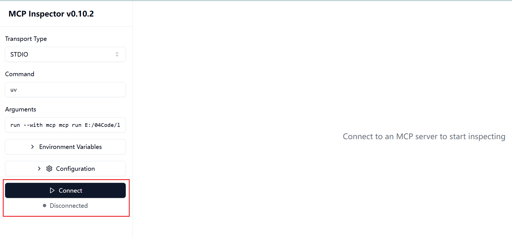
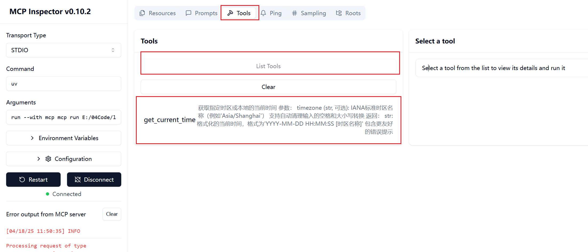
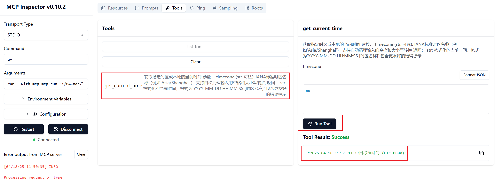
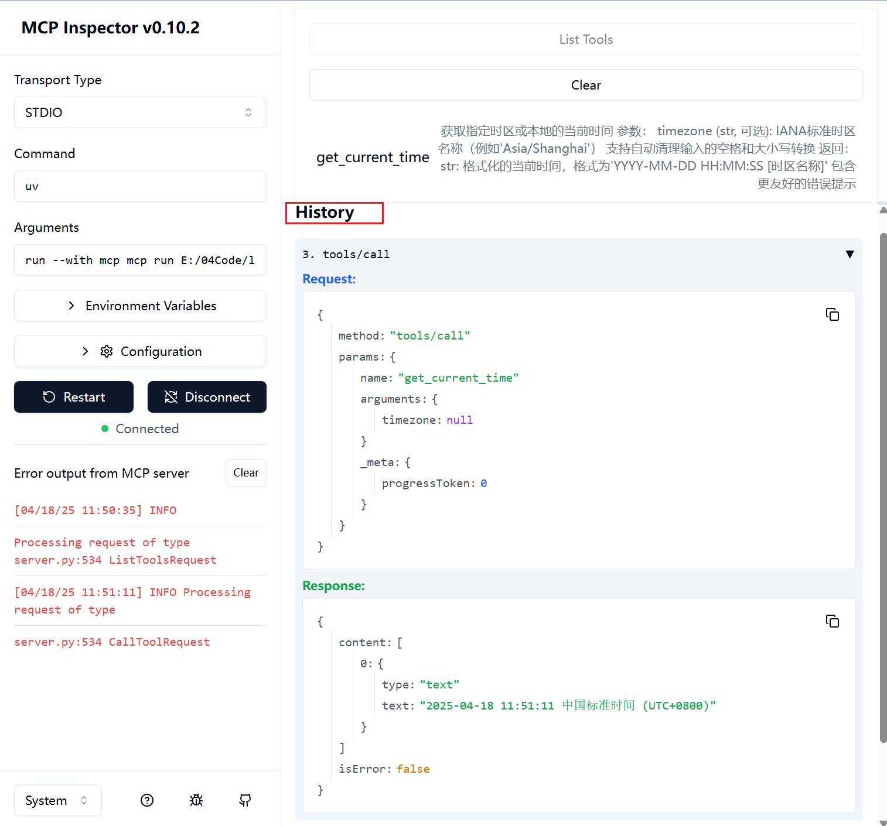
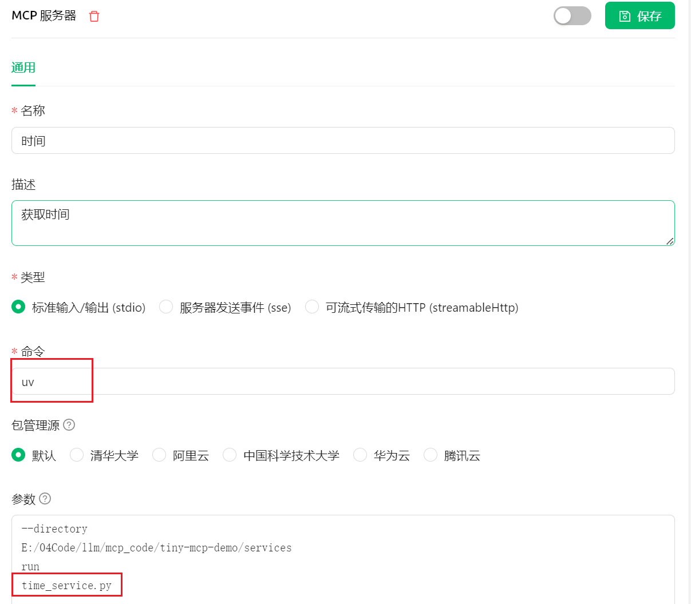
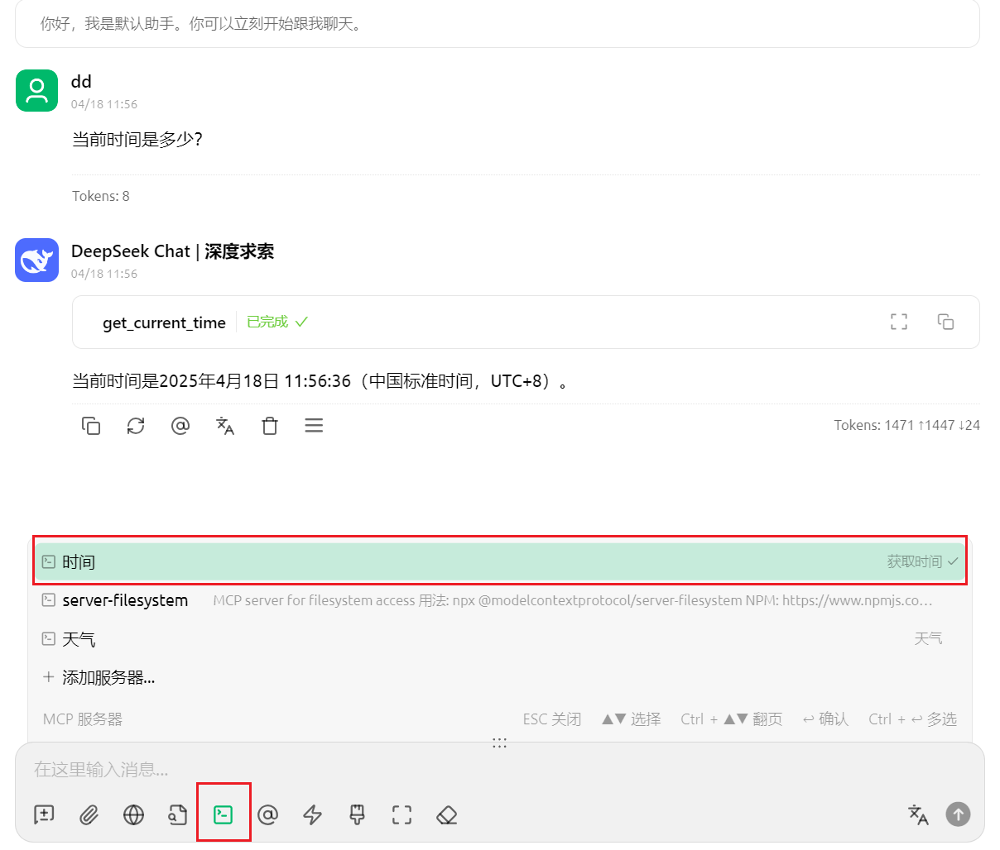
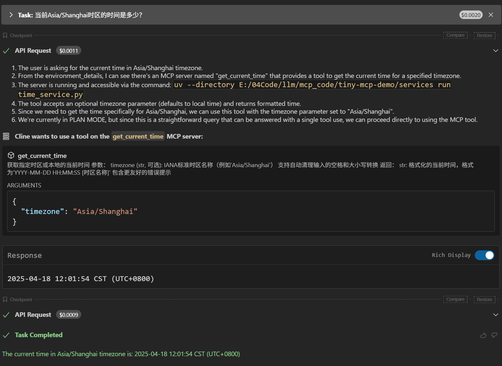

# 5.MCP Server开发调试

> 注意：如下实现基于Python语言

## 1.基于LLM构建MCP Server

在官方文档（[quickstart/server](https://modelcontextprotocol.io/quickstart/server "quickstart/server")）中，可以找到`MCP Server`的开发方式，以及官方提供的各个语言的 SDK 的示例代码。

官方建议通过`AI`来帮我们实现`MCP`，所以在文档中单独还提供了一个[Building MCP with LLMs](https://modelcontextprotocol.io/tutorials/building-mcp-with-llms "Building MCP with LLMs")的章节。

Building MCP with LLMs 大致思路：

```markdown 
在开始之前，收集必要的文档，以帮助 AI 了解 MCP：

访问 https://modelcontextprotocol.io/llms-full.txt 并复制完整的文档文本。
导航到 MCP 的 TypeScript 软件开发工具包（SDK）或 Python 软件开发工具包的代码仓库。
复制（README）和其他相关文档。
将这些文档粘贴到你与克劳德的对话中。
提供了相关文档之后，向 AI 清晰地描述你想要构建的服务器类型：

你的服务器将公开哪些资源。
它将提供哪些工具。
它应该给出的任何提示。
它需要与哪些外部系统进行交互。
比如这是一个例子：构建一个 MCP 服务器，该服务器：

连接到我公司的 PostgreSQL 数据库。
将表模式作为资源公开。
提供用于运行只读 SQL 查询的工具。
包含针对常见数据分析任务的提示。
```


在实际测试中发现，上面提到的 [https://modelcontextprotocol.io/llms-full.txt](https://modelcontextprotocol.io/llms-full.txt "https://modelcontextprotocol.io/llms-full.txt") 这个文档就是整个文档站的内容，里面包含了很多构建 MCP Server 不需要的内容，反而会给模型造成干扰，大家可以直接参考下面的提示词：

```markdown 
## 需求

基于提供的 MCP 相关资料，帮我构建一个 MCP Server，需求如下：

- 提供一个获取当前时间的工具
- 接收时区作为参数（可选）
- 编写清晰的注释和说明
- 要求功能简洁、只包含关键功能
- 使用 Python 语言编写

请参考下面四个资料：

## [参考资料 1] MCP 基础介绍

- 粘贴 https://modelcontextprotocol.io/introduction 里的内容。

## [参考资料 2] MCP 核心架构

- 粘贴 https://modelcontextprotocol.io/docs/concepts/architecture 里的内容。

## [参考资料 3] MCP Server 开发指引

- 粘贴 https://modelcontextprotocol.io/quickstart/server 里的内容。

## [参考资料 4] MCP Python SDK 文档

- 粘贴 https://github.com/modelcontextprotocol/python-sdk/blob/main/README.md 里的内容。
```


下面是一个 AI 生成好的 MCP Server 的关键代码：

```python 
from datetime import datetime
from zoneinfo import ZoneInfo, ZoneInfoNotFoundError
from typing import Optional
from mcp.server.fastmcp import FastMCP

mcp = FastMCP("TimeServer")

@mcp.tool()
def get_current_time(timezone: Optional[str] = None) -> str:
    """
    获取指定时区或本地的当前时间
    
    参数：
        timezone (str, 可选): IANA标准时区名称（例如'Asia/Shanghai'）
                            支持自动清理输入的空格和大小写转换
    
    返回：
        str: 格式化的当前时间，格式为'YYYY-MM-DD HH:MM:SS [时区名称]'
            包含更友好的错误提示
    """
    try:
        # 输入清理和规范化
        if timezone:
            # 去除前后空格并替换下划线为斜杠（处理常见笔误）
            cleaned_tz = timezone.strip().replace("_", "/")
            tz = ZoneInfo(cleaned_tz)
        else:
            tz = datetime.now().astimezone().tzinfo
        
        current_time = datetime.now(tz)
        
        # 添加时区详细信息
        tz_info = (
            f"{tz.tzname(current_time)} "
            f"(UTC{current_time.strftime('%z')})"
        )
        
        return current_time.strftime(f"%Y-%m-%d %H:%M:%S {tz_info}")
        
    except ZoneInfoNotFoundError as e:
        # 提供常见时区示例
        examples = "\n".join([
            "常见时区示例：",
            "- Europe/London", 
            "- Asia/Shanghai",
            "- UTC",
            "完整列表：https://en.wikipedia.org/wiki/List_of_tz_database_time_zones"
        ])
        return f"无效时区名称：'{timezone}'\n{examples}"
    except Exception as e:
        return f"时间服务暂时不可用，请稍后再试（错误代码：{hash(e) & 0xFFFF})"

if __name__ == "__main__":
    mcp.run(transport='stdio')
```


代码主要有三部分组成：

1. 使用`FastMCP`包，创建一个`mcp` 实例；
2. 使用`@mcp.tool`定义提供的工具方法，包括工具方法的名称、工具方法的描述、工具方法的参数、工具方法的具体实现逻辑。
3. 启动 Server，并且使用`transport`来定义工具使用`STDIO`通信协议，等待外部的标准输入，并且把工具的执行结果转化为标准输出反馈到外部。

只需要按照这个模板来添加更多的工具实现就可以了，另外 Resources、Prompt 的编写方式其实都是类似的，大家只需要按照这套提示词模板，定义好自己的需求，AI（Claude 的准确性最高）基本上都能比较完整的实现。

## 2.调试MCP Server

开发完成后，可以直接使用官方提供的`MCP Server`调试工具（`mcp dev`）来进行调试。

在终端中运行如下命令，调试刚刚开发完成的MCP Server：

```bash 
mcp dev services/time_service.py
```


启动日志：

```bash 
(tiny-mcp) PS tiny-mcp> mcp dev E:/04Code/llm/mcp_code/services/time_service.py
Starting MCP inspector...
⚙️ Proxy server listening on port 6277
🔍 MCP Inspector is up and running at http://127.0.0.1:6274 🚀
```


启动成功后，它会在我们的本地监听 6274 端口，我们点击`Connect`：



连接成功后，我们点击`List Tools`：



然后可以看到当前`MCP Server`定义的所有工具，这里定义了一个获取当前时间的工具，点击这个工具，可以对它进行调试：



可以在下方所有交互产生的请求和响应的具体数据：



基于这样的思路，可以使用`mcp dev`调试任意的`MCP Server`， 在你想要使用，但是还不知道怎么使用一个`MCP Server`时，都可以使用它进行调试

## 3.测试MCP Server

### 3.1 Cherry Studio

在 Cherry Studio中如下配置，集合使用：



测试运行：



### 3.2 Cline

配置`MCP Server`：

```json 
{
  "mcpServers": {
    "get_current_time": {
      "name": "时间",
      "type": "stdio",
      "description": "获取时间",
      "isActive": true,
      "registryUrl": "",
      "command": "uv",
      "args": [
        "--directory",
        "E:/04Code/llm/mcp_code/tiny-mcp-demo/services",
        "run",
        "time_service.py"
      ]
    }
  }
}
```


运行结果：




