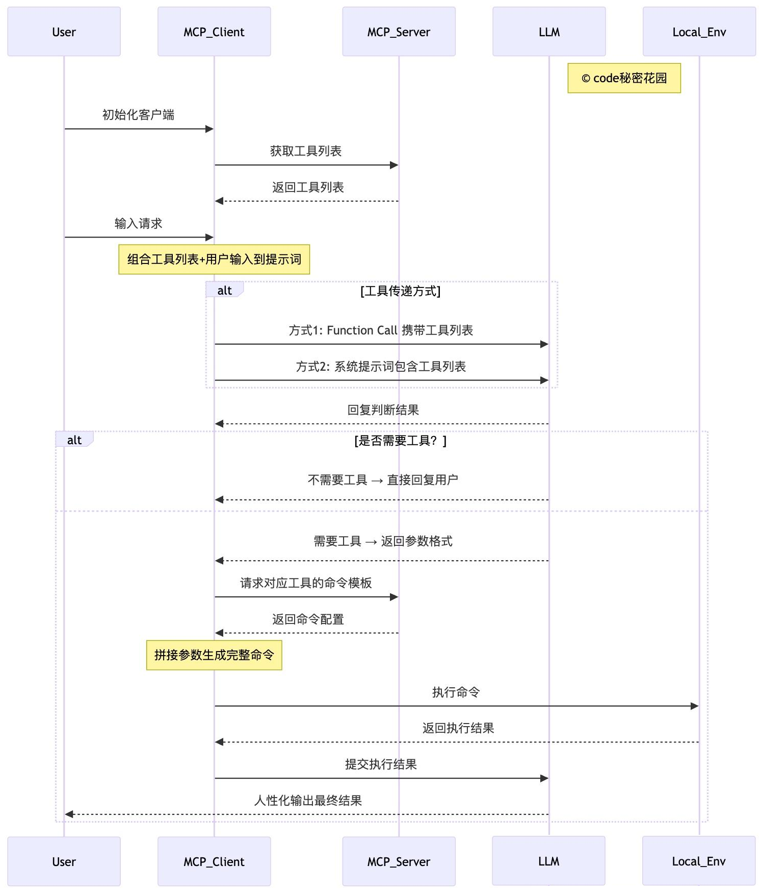

# 6.MCP核心交互流程

`Cherry Studio`实际上是通过将`MCP Server`中提供的工具、响应结果，转换为`Function Call`的标准格式来和模型进行交互。

`Cline`将`MCP Server`中提供的工具、响应结果转换未一套自己约定的输入、输出的标准数据格式，通过系统提示词来声明这种约定，再和模型进行交互。

这也解释了，为什么在`Cherry Studio`中只有一部分模型支持`MCP`，前提是选择的模型需要支持 Function Call 的调用，并且在客户端进行了特殊适配；而`Cline`则使用的是系统提示词，所以所有模型都支持。

#### **（1）初始化与工具列表获取** &#x20;

用户首先对MCP客户端进行初始化操作，随后MCP客户端向MCP服务器发送请求以获取可用的工具列表，MCP服务器将工具列表返回给客户端。

#### （2）**用户输入与提示词构建** &#x20;

用户在客户端完成初始化后，向MCP客户端输入具体请求。客户端将此前获取的工具列表与用户输入内容相结合，共同组成用于询问LLM的提示词。

#### （3）**工具传递方式选择** &#x20;

MCP客户端通过两种方式之一将提示词传递给LLM：

- **方式1**：使用Function Call（函数调用）直接携带工具列表信息；
- **方式2**：在系统提示词（System Prompt）中包含工具列表。

#### （4）**LLM判断与响应** &#x20;

LLM接收到提示词后，返回判断结果：

- **无需工具**：LLM直接将处理结果通过MCP客户端回复给用户；
- **需要工具**：LLM先向客户端返回所需工具的参数格式要求。

#### （5）**工具命令生成与执行** &#x20;

若需要工具，MCP 客户端根据 LLM 提供的参数格式，以及 MCP Server 配置的命令模板进行拼接，生成完整的可执行命令，并在本地环境（Local\_Env）中执行该命令。

#### （6）**结果处理与输出** &#x20;

本地环境执行命令后，将结果返回给 MCP 客户端。客户端将执行结果提交给 LLM，由 LLM 对技术化的执行结果进行处理，最终以人性化的语言形式输出给用户。
