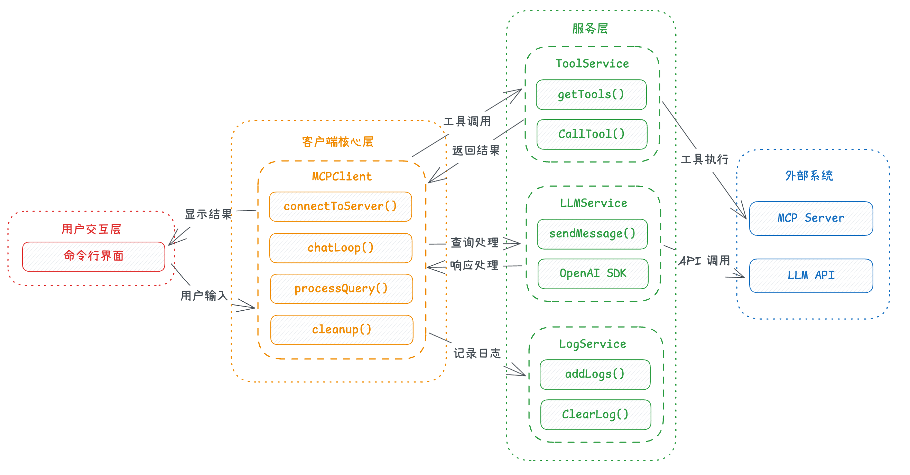
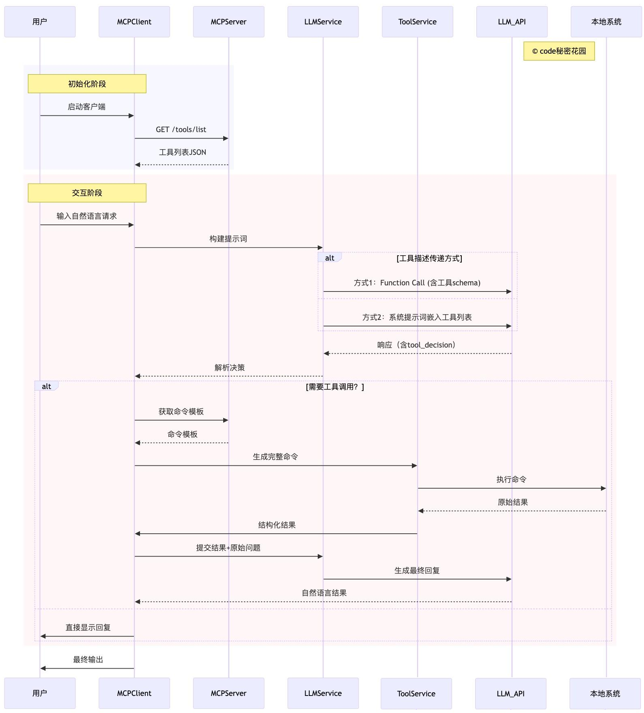

# 7.MCP Client交互流程

## 1.基于LLM构建MCP Client

同样的，客户端的核心逻辑也是基于 AI 编写的，大家可以直接使用这个提示词：

```markdown 
## 需求
我想开发一个 Python 版的 MCP Clinet ，下面有一些参考材料，包括 MCP 基础介绍、MCP 核心架构介绍、MCP Clinet 开发教程，请你根据这些参考材料帮我开发一个 MCP Client，注意增加完善的中文注释，以及在开发完成后编写一个完善的中文 Readme 说明文档。

## MCP 基础介绍

粘贴 https://modelcontextprotocol.io/introduction 的内容。

## MCP 核心架构介绍

粘贴 https://modelcontextprotocol.io/docs/concepts/architecture 的内容。

## MCP Client 开发教程

粘贴 https://modelcontextprotocol.io/quickstart/client 的内容。

## 注意

- 使用 openai 的 SDK 替换 @anthropic-ai/sdk ，这样可以支持更多的模型，兼容性更好
- 你不要指定依赖的版本，如果遇到安装依赖让我自己来安装，你只负责编写代码
```


## 2.tiny-mcp项目介绍



### 2.1 安装和配置

- 克隆仓库

```bash 
https://github.com/wdndev/tiny-mcp.git
cd tiny-mcp
```


- 安装UV

```bash 
# Linux & MAC
使用 curl 下载脚本并通过 sh 执行：

curl -LsSf https://astral.sh/uv/install.sh | sh

# Windows
使用 irm 下载脚本并通过 iex 执行：

powershell -ExecutionPolicy ByPass -c "irm https://astral.sh/uv/install.ps1 | iex"

```


- 安装依赖

```bash 
uv venv --python 3.12
uv sync
```


- 配置环境变量

```bash 
# 复制示例环境变量文件并设置你的 LLM API 密钥：

cp .env.example .env

# 然后编辑 .env 文件，填入你的 LLM API 密钥、模型提供商 API 地址、以及模型名称：

LLM_MODEL_TYPE = "deepseek"
LLM_API_URL = "https://api.deepseek.com"
LLM_API_KEY = "sk-xxxxxxxxxxxxxxxxxx"
LLM_MODEL_NAME = "deepseek-chat"


```


### 2.2 使用方法

激活uv环境

```bash 
# Linux & MAC
source .venv/bin/activate

# Windows
./.venv/Scripts/activate


```


要启动 MCP 客户端，可以使用以下几种方式：

#### （1）直接指定服务器脚本路径

```bash 
python sample_mcp_client.py <服务器脚本路径>
```


其中`<服务器脚本路径>`是指向 MCP 服务器脚本的路径，可以是 JavaScript (.js) 或 Python (.py) 文件。

#### （2）使用配置文件

```bash 
python sample_mcp_client.py <服务器标识符> <配置文件路径>
```


其中`<服务器标识符>`是配置文件中定义的服务器名称，`<配置文件路径>`是包含服务器定义的 JSON 文件的路径。

```json 
{
    "mcpServers": {
      "get_current_time": {
        "name": "时间",
        "type": "stdio",
        "description": "获取时间",
        "command": "uv",
        "args": [
          "--directory",
          "E:/04Code/llm/mcp_code/tiny-mcp-demo/services",
          "run",
          "time_service.py"
        ]
      },
      "get_weather": {
        "name": "天气",
        "type": "stdio",
        "description": "获取国内天气",
        "command": "uv",
        "args": [
          "--directory",
          "E:/04Code/llm/mcp_code/tiny-mcp-demo/services",
          "run",
          "weather_service_zh.py"
        ]
      }
    },
    "defaultServer": "get_current_time",
    "system": "自定义系统提示词"
}
```


### 2.3 运行

直接指定服务器脚本路径运行

```bash 
(tiny-mcp) PS tiny-mcp> python sample_mcp_client.py E:/04Code/llm/mcp_code/tiny-mcp-demo/services/weather_service_zh.py
[SYS]: 成功连接服务器，可用工具: ['get_weather']
[SYS]: MCP客户端已启动！
[SYS]: 输入自然语言查询开始交互（输入 'quit' 退出）
[USR]: 北京天气如何？适合去天安门吗？
[LOG]: 调用工具 [get_weather] 参数: {'location': '北京'}

[LLM]: 北京的天气是多云，温度为29°C，体感温度26°C，北风3级，湿度较低（18%），能见度良好（21公里）。

这样的天气适合去天安门游玩，但建议注意防晒和补水，因为湿度较低可能会感觉干燥。 

[USR]: 现在沈阳的天气怎么样呢？能出去踢足球吗？
[LOG]: 调用工具 [get_weather] 参数: {'location': '沈阳'}

[LLM]: 沈阳目前有小雨，气温为15°C，体感温度14°C，西南风2级，风速8公里/小时，相对湿度74%。由于有小雨，场地可能会比较湿滑，不太适合踢足球。建议等天气转晴后再安排户外活动。 

[USR]: quit
```


使用配置文件

```bash 
(tiny-mcp) PS tiny-mcp> python sample_mcp_client.py get_weather config/mcp_config.json
[SYS]: 成功连接服务器，可用工具: ['get_weather']
[SYS]: MCP客户端已启动！
[SYS]: 输入自然语言查询开始交互（输入 'quit' 退出）
[USR]: 珠海天气怎么样？适合出行吗？
[LOG]: 调用工具 [get_weather] 参数: {'location': '珠海'}

[LLM]: 珠海目前的天气情况如下：

- **天气**：阴天
- **温度**：25°C（体感温度27°C）
- **风向**：南风，风力3级，风速14公里/小时
- **湿度**：92%
- **能见度**：12公里
- **降水量**：过去1小时无降水

总体来说，天气较为阴湿，但温度适中，风力不大，适合出行。建议根据个人对湿度的适应情况决定是否外出，并可以携带雨具以防万一。 

[USR]: 北京的天气如何？能去参观天安门吗？
[LOG]: 调用工具 [get_weather] 参数: {'location': '北京'}

[LLM]: 北京的天气目前是中雨，温度为11°C，体感温度为10°C，北风2级，相对湿度100%，能见度为4公里。由于下雨，可能会影响户外活动。

如果您计划参观天安门，建议携带雨具，并注意地面湿滑。如果雨势较大，可能会影响游览体验，建议根据天气情况灵活调整行程。
```


## 3.最终流程总结

以上的过程，非常清晰的展示了整个 MCP 的交互流程，下面我们最后再总结一下：

### **4.1 初始化阶段**

#### （·）**客户端启动与工具列表获取**

- 用户首先启动**MCPClient**，完成初始化操作。
- **MCPClient**向**MCPServer**发送**GET /tools/list**请求，获取可用工具的元数据。
- **MCPServer**返回包含工具名称、功能描述、参数要求等信息的**工具列表JSON**，供客户端后续构建提示词使用。

### 4.2**交互阶段**

#### **（1）用户输入与提示词构建**

- 用户通过**MCPClient**输入自然语言请求（如“查询服务器状态”“生成文件报告”等）。
- **MCPClient**将用户请求与初始化阶段获取的**工具列表**结合，生成包含任务目标和工具能力的提示词（Prompt），传递给**LLMService**（大语言模型服务层）。

#### **（2）工具描述传递方式（二选一）**

- **方式1（Function Call）**： &#x20;

  **LLMService**通过**LLM\_API**调用大语言模型时，在请求中直接携带**工具schema**（结构化工具定义，如参数格式、调用格式），告知模型可用工具的调用方式。
- **方式2（系统提示词嵌入）**： &#x20;

  **LLMService**将工具列表以自然语言描述形式嵌入**系统提示词**（System Prompt），让模型在理解用户需求时知晓可用工具的功能边界。

#### （3）**模型决策与响应解析**

- **LLM\_API**返回包含**tool\_decision**（工具调用决策）的响应：
- 若判定**无需工具**（如简单文本回复），响应直接包含最终答案；
- 若判定**需要工具**（如需要执行本地命令、调用外部接口），响应中包含所需工具的参数要求（如工具名称、入参格式）。
- **LLMService**解析决策结果，将信息传递给**MCPClient**。

#### **（4）工具调用分支（需要工具时）**

- **获取命令模板**：**MCPClient**根据模型指定的工具名称，在初始化时保存的工具配置中取出对应的**命令模板**（如Shell命令格式、API调用参数模板）。
- **生成与执行命令**：**MCPClient**将用户输入参数与命令模板结合，通过**ToolService**（工具执行服务）生成完整可执行命令，并提交给**本地系统**执行。
- **结果处理**：**本地系统**返回原始执行结果（如命令输出文本、API返回数据），**ToolService**将其转换为**结构化结果**（如JSON格式），反馈给**MCPClient**。
- **二次调用模型生成最终回复**：**MCPClient**将结构化结果与用户原始问题一并提交给**LLMService**，通过**LLM\_API**调用模型，将技术化的执行结果转化为自然语言描述（如将“服务器CPU使用率80%”转化为“当前服务器CPU负载较高，建议检查进程”）。

#### （5）**直接回复分支（无需工具时）**

- 若模型判定无需工具，**MCPClient**直接将模型响应显示给用户（如简单的文本问答、信息总结）。

### **4.3 最终输出**

无论是否经过工具调用，**MCPClient**最终将处理后的**自然语言结果**呈现给用户，完成整个交互流程。


